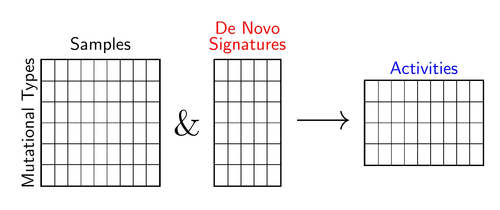
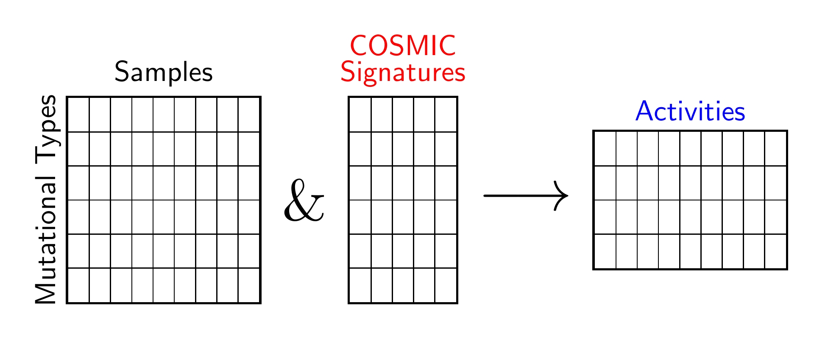

[](https://opensource.org/licenses/BSD-2-Clause)
[](https://app.travis-ci.com/AlexandrovLab/SigProfilerAssignment)


# SigProfilerAssignment
SigProfilerAssignment is a new mutational attribution and decomposition tool that performs the following functions:
-   Attributing a known set of mutational signatures to an individual sample or multiple samples.
-   Decomposing de novo signatures to COSMIC signature database.
-   Attributing COSMIC database or a custom signature database to given samples.

The tool identifies the activity of each signature in the sample and assigns the probability for each signature to cause a specific mutation type in the sample. The tool makes use of SigProfilerMatrixGenerator, SigProfilerExtractor and SigProfilerPlotting.


## Installs
for installing from PyPi in new conda environment

```
$ pip install SigProfilerAssignment
```

Installing this package : git clone this repo or download the zip file.
Unzip the contents of SigProfilerExtractor-master.zip or the zip file of a corresponding branch.

```bash
$ cd SigProfilerAssignment-master
$ pip install .
```
## Signature Subtypes
```python
signature_subgroups = ['remove_MMR_deficiency_signatures',
                       'remove_POL_deficiency_signatures',
                       'remove_HR_deficiency_signatures' ,
                       'remove_BER_deficiency_signatures',
                       'remove_Chemotherapy_signatures',
                       'remove_Immunosuppressants_signatures'
                       'remove_Treatment_signatures'
                       'remove_APOBEC_signatures',
                       'remove_Tobacco_signatures',
                       'remove_UV_signatures',
                       'remove_AA_signatures',
                       'remove_Colibactin_signatures',
                       'remove_Artifact_signatures',
                       'remove_Lymphoid_signatures']
```


| Signature Subgroup      | SBS Signatures that are excluded |
| ----------- | ----------- |
|MMR_deficiency_signatures|	6, 14, 15, 20, 21, 26, 44|
|POL_deficiency_signatures|	10a, 10b, 10c, 10d, 28|
|HR_deficiency_signatures|	3|
|BER_deficiency_signatures|	30, 36|
|Chemotherapy_signatures|	11, 25, 31, 35, 86, 87, 90|
|Immunosuppressants_signatures|	32|
|Treatment_signatures|	11, 25, 31, 32, 35, 86, 87, 90|
|APOBEC_signatures|	2, 13|
|Tobacco_signatures	|4, 29, 92|
|UV_signatures|	7a, 7b, 7c, 7d, 38|
|AA_signatures|	22|
|Colibactin_signatures|	88|
|Artifact_signatures|	27, 43, 45, 46, 47, 48, 49, 50, 51, 52, 53, 54, 55, 56, 57, 58, 59, 60|
|Lymphoid_signatures|	9, 84, 85|

<!-- 
```python
spa_analyze(  samples,  output, signatures=None, signature_database=None,decompose_fit= True,denovo_refit=True,cosmic_fit=True, nnls_add_penalty=0.05, 
              nnls_remove_penalty=0.01, initial_remove_penalty=0.05, de_novo_fit_penalty=0.02, 
              genome_build="GRCh37",  make_decomposition_plots=True, collapse_to_SBS96=True,connected_sigs=True, verbose=False): 
```  -->
### Decompose Fit
Decomposes the De Novo Signatures into COSMIC Signatures and assigns COSMIC signatures into samples.


```python
from SigProfilerAssignment import Analyzer as Analyze
Analyze.decompose_fit(samples, 
                       output, 
                       signatures=signatures,
                       signature_database=sigs,
                       genome_build="GRCh37", 
                       verbose=False,
                       new_signature_thresh_hold=0.8,
                       signature_subgroups=signature_subgroups)
```
### *De Novo* Fit
Attributes mutations of given Samples to input denovo signatures.


```python
from SigProfilerAssignment import Analyzer as Analyze
Analyze.denovo_fit( samples,
                    output, 
                    signatures=signatures,
                    signature_database=sigs,
                    genome_build="GRCh37", 
                    verbose=False)
```
### COSMIC Fit
Attributes mutations of given Samples to input COSMIC signatures. Note that penalties associated with denovo fit and COSMIC fits are different.


```python
from SigProfilerAssignment import Analyzer as Analyze
Analyze.cosmic_fit( samples, 
                    output, 
                    signatures=None,
                    signature_database=sigs,
                    genome_build="GRCh37", 
                    verbose=False,
                    collapse_to_SBS96=False,
                    signature_subgroups=signature_subgroups,
                    make_plots=True)
```
## Main Parameters
| Parameter | Variable Type | Parameter Description |
| --------------------- | -------- |-------- |
| **signatures** | String | Path to a  tab delimited file that contains the signaure table where the rows are mutation types and colunms are signature IDs. |
| **activities** | String | Path to a tab delimilted file that contains the activity table where the rows are sample IDs and colunms are signature IDs. |
| **samples** | String | Path to a tab delimilted file that contains the activity table where the rows are mutation types and colunms are sample IDs. |
| **output** | String | Path to the output folder. |
| **genome_build** | String | The genome type. Example: "GRCh37", "GRCh38", "mm9", "mm10". The default value is "GRCh37" |
| **new_signature_thresh_hold**|Float | Parameter in Cosine similarity to declare a  new signature. Applicable for decompose fit only. The default value is 0.8  |
| **make_plots** | Boolean | Toggle on and off for making and saving all plots. Default value is True.  |
| **signature_subgroups** | List | Removes the signatures corresponding to specific subtypes for better fitting. The usage is given above. Default value is None.  |
| **verbose** | Boolean | Prints statements. Default value is False.  |

        

#### SPA analysis Example


```python
#import modules
import SigProfilerAssignment as spa
from SigProfilerAssignment import Analyzer as Analyze

#set directories and paths to signatures and samples
dir_inp     = spa.__path__[0]+'/data/Examples/'
signatures  = dir_inp+"Results_scenario_8/SBS96/All_Solutions/SBS96_3_Signatures/Signatures/SBS96_S3_Signatures.txt"
activities  = dir_inp+"Results_scenario_8/SBS96/All_Solutions/SBS96_3_Signatures/Activities/SBS96_S3_NMF_Activities.txt"
samples     = dir_inp+"Input_scenario_8/Samples.txt"
output      = "output_example/"
sigs        = "COSMIC_v3_SBS_GRCh37_noSBS84-85.txt" #Custom Signature Database

#Analysis of SP Assignment 
Analyze.cosmic_fit( samples, 
                    output, 
                    signatures=None,
                    signature_database=sigs,
                    genome_build="GRCh37", 
                    verbose=False,
                    collapse_to_SBS96=False,
                    signature_subgroups=signature_subgroups,
                    make_plots=True)

```
## <a name="copyright"></a> Copyright
This software and its documentation are copyright 2022 as a part of the SigProfiler project. The SigProfilerAssignment framework is free software and is distributed in the hope that it will be useful, but WITHOUT ANY WARRANTY; without even the implied warranty of MERCHANTABILITY or FITNESS FOR A PARTICULAR PURPOSE. See the GNU General Public License for more details.

## <a name="contact"></a> Contact Information
Please address any queries or bug reports to Raviteja Vangara at rvangara@health.ucsd.edu
