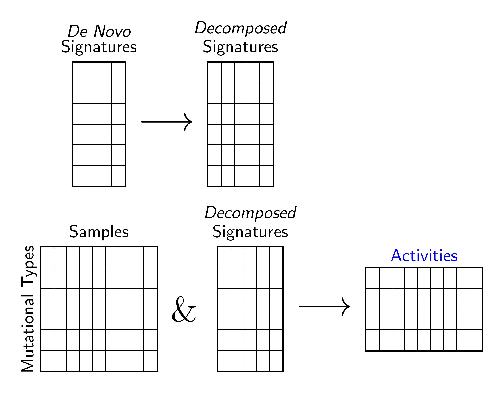
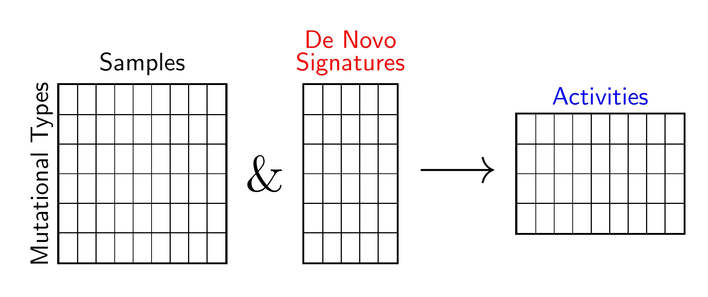
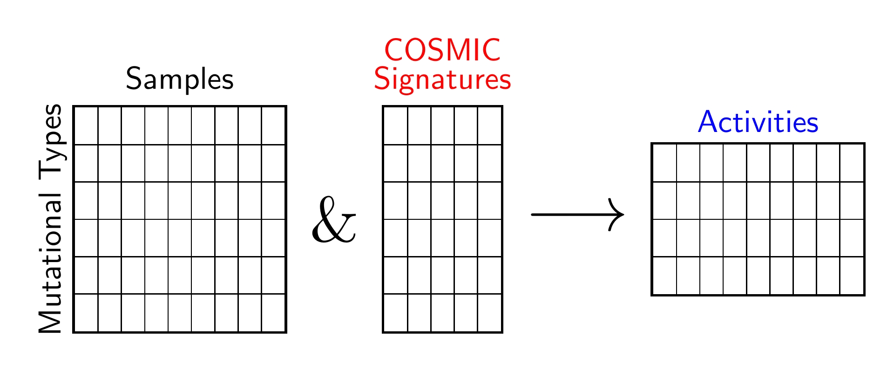

[](https://opensource.org/licenses/BSD-2-Clause)
[](https://app.travis-ci.com/AlexandrovLab/SigProfilerAssignment)


# SigProfilerAssignment
SigProfilerAssignment is a new mutational attribution and decomposition tool that performs the following functions:
-   Attributing a known set of mutational signatures to an individual sample or multiple samples.
-   Decomposing de novo signatures to COSMIC signature database.
-   Attributing COSMIC database or a custom signature database to given samples.

The tool identifies the activity of each signature in the sample and assigns the probability for each signature to cause a specific mutation type in the sample. The tool makes use of SigProfilerMatrixGenerator, SigProfilerExtractor and SigProfilerPlotting.


## Installs
for installing from PyPi in new conda environment

```
$ pip install SigProfilerAssignment
```

Installing this package : git clone this repo or download the zip file.
Unzip the contents of SigProfilerExtractor-master.zip or the zip file of a corresponding branch.

```bash
$ cd SigProfilerAssignment-master
$ pip install .
```
## Signature Subgroups
```python
exclude_signature_subgroups = ['MMR_deficiency_signatures',
                               'POL_deficiency_signatures',
                               'HR_deficiency_signatures' ,
                               'BER_deficiency_signatures',
                               'Chemotherapy_signatures',
                               'Immunosuppressants_signatures'
                               'Treatment_signatures'
                               'APOBEC_signatures',
                               'Tobacco_signatures',
                               'UV_signatures',
                               'AA_signatures',
                               'Colibactin_signatures',
                               'Artifact_signatures',
                               'Lymphoid_signatures']
```


|Signature subgroup |           SBS signatures excluded | DBS signatures excluded | ID signatures excluded |
| ----------- | ----------- | ----------- | ----------- |
|MMR_deficiency_signatures|     6, 14, 15, 20, 21, 26, 44|      7, 10|  7|
|POL_deficiency_signatures|     10a, 10b, 10c, 10d, 28|         3|      -|
|HR_deficiency_signatures|      3|                              -|      6|
|BER_deficiency_signatures|     30, 36|                         -|      -|
|Chemotherapy_signatures|       11, 25, 31, 35, 86, 87, 90|     5|      -|
|Immunosuppressants_signatures| 32|                             -|      -|
|Treatment_signatures|          11, 25, 31, 32, 35, 86, 87, 90| 5|      -|
|APOBEC_signatures|             2, 13|                          -|      -|
|Tobacco_signatures |           4, 29, 92|                      2|      3|
|UV_signatures|                 7a, 7b, 7c, 7d, 38|             1|      13|
|AA_signatures|                 22|                             -|      -|
|Colibactin_signatures|         88|                             -|      18|
|Artifact_signatures|           27, 43, 45, 46, 47, 48, 49, 50, 51, 52, 53, 54, 55, 56, 57, 58, 59, 60, 95|-|-|
|Lymphoid_signatures|           9, 84, 85|                      -|      -|

<!-- 
```python
spa_analyze(  samples,  output, signatures=None, signature_database=None,decompose_fit= True,denovo_refit=True,cosmic_fit=True, nnls_add_penalty=0.05, 
              nnls_remove_penalty=0.01, initial_remove_penalty=0.05, de_novo_fit_penalty=0.02, 
              genome_build="GRCh37",  make_decomposition_plots=True, collapse_to_SBS96=True,connected_sigs=True, verbose=False): 
```  -->
### Decompose Fit
Decomposes the De Novo Signatures into COSMIC Signatures and assigns COSMIC signatures into samples.


```python
from SigProfilerAssignment import Analyzer as Analyze
Analyze.decompose_fit(samples, 
                       output, 
                       signatures=signatures,
                       signature_database=sigs,
                       genome_build="GRCh37", 
                       verbose=False,
                       new_signature_thresh_hold=0.8,
                       exclude_signature_subgroups=exclude_signature_subgroups,
                       exome=False)
```

## Analysis

### *De Novo* Fit
Attributes mutations of given Samples to input denovo signatures.


```python
from SigProfilerAssignment import Analyzer as Analyze
Analyze.denovo_fit( samples,
                    output, 
                    signatures=signatures,
                    signature_database=sigs,
                    genome_build="GRCh37", 
                    verbose=False)
```
### COSMIC Fit
Attributes mutations of given Samples to input COSMIC signatures. Note that penalties associated with denovo fit and COSMIC fits are different.



```python
from SigProfilerAssignment import Analyzer as Analyze
Analyze.cosmic_fit( samples, 
                    output, 
                    signatures=None,
                    signature_database=sigs,
                    genome_build="GRCh37", 
                    verbose=False,
                    collapse_to_SBS96=False,
                    make_plots=True,
                    exclude_signature_subgroups=exclude_signature_subgroups,
                    exome=False
)
```
## Main Parameters
| Parameter | Variable Type | Parameter Description |
| --------------------- | -------- |-------- |
| **samples** | String | Path to input file for `input_type`:<ul><li>"matrix"</li><li>"seg:TYPE"</li></ul> Path to input folder for `input_type`:<ul><li>"vcf"</li></ul>|
| **output** | String | Path to the output folder. |
 | **input_type** | String | The type of input:<br><ul><li>"matrix": used for table format inputs using a tab-separated file where the rows are mutation types and the columns are sample IDs.</li><li>"vcf": used for mutation calling file inputs (VCFs, MAFs or simple text files).</li><li>"seg:TYPE": used for a multi-sample segmentation file for copy number analysis. Please check the required format at https://github.com/AlexandrovLab/SigProfilerMatrixGenerator#copy-number-matrix-generation. The accepted callers for TYPE are the following {"ASCAT", "ASCAT_NGS", "SEQUENZA", "ABSOLUTE", "BATTENBERG", "FACETS", "PURPLE", "TCGA"}. For example, when using segmentation file from BATTENBERG then set input_type to "seg:BATTENBERG".</li></ul> The default value is "matrix".|
| **context_type**| String| Required context type if `input_type` is "vcf". `context_type` takes which context type of the input data is considered for assignment. Valid options include "96", "288", "1536", "DINUC", and "ID". The default value is "96".|
| **signatures** | String | Path to a tab delimited file that contains the signature table where the rows are mutation types and colunms are signature IDs. |
| **genome_build** | String | The reference genome build. List of supported genomes: "GRCh37", "GRCh38", "mm9", "mm10" and "rn6". The default value is "GRCh37". If the selected genome is not in the supported list, the default genome will be used. |
| **cosmic_version** | Float | Takes a positive float among 1, 2, 3, 3.1, 3.2 and 3.3. Defines the version of the COSMIC reference signatures. The default value is 3.3. |
| **new_signature_thresh_hold**| Float | Parameter in cosine similarity to declare a new signature. Applicable for decompose_fit only. The default value is 0.8. |
| **exclude_signature_subgroups** | List | Removes the signatures corresponding to specific subtypes for better fitting. The usage is given above. The default value is None. |
| **exome** | Boolean | Defines if the exome renormalized signatures will be used. The default value is False. |
| **export_probabilities** | Boolean | Defines if the probability matrix per mutational context for all samples is created. The default value is True. |
| **export_probabilities_per_mutation** | Boolean | Defines if the probability matrices per mutation for all samples are created. Only available when `input_type` is "vcf". The default value is False. |
| **make_plots** | Boolean | Toggle on and off for making and saving all plots. The default value is True. |
| **verbose** | Boolean | Prints statements. The default value is False. |


        

## Examples

### SPA analysis - Example for a matrix


```python
#import modules
import SigProfilerAssignment as spa
from SigProfilerAssignment import Analyzer as Analyze

#set directories and paths to signatures and samples
dir_inp     = spa.__path__[0]+'/data/Examples/'
samples     = dir_inp+"Input_scenario_8/Samples.txt"
output      = "output_example/"
signatures  = dir_inp+"Results_scenario_8/SBS96/All_Solutions/SBS96_3_Signatures/Signatures/SBS96_S3_Signatures.txt"
sigs        = "COSMIC_v3_SBS_GRCh37_noSBS84-85.txt" #Custom Signature Database

#Analysis of SP Assignment 
Analyze.cosmic_fit( samples, 
                    output, 
                    signatures=None,
                    signature_database=sigs,
                    genome_build="GRCh37",
                    cosmic_version=3.3,
                    verbose=False,
                    collapse_to_SBS96=False,
                    make_plots=True,
                    exclude_signature_subgroups=None,
                    exome=False)

```

### SPA analysis - Example for input vcf files


```python
#import modules
import SigProfilerAssignment as spa
from SigProfilerAssignment import Analyzer as Analyze
import os

#set directories and paths to signatures and samples
dir_inp = os.path.join(spa.__path__[0], '/data/Examples/')
# directory of vcf files
samples = os.path.join(spa.__path__[0], '/data/tests/vcf_input/')
output = "output_example/"
signatures = os.path.join(dir_inp, \
    "Results_scenario_8/SBS96/All_Solutions/SBS96_3_Signatures/Signatures/" \
    + "SBS96_S3_Signatures.txt")
sigs = "COSMIC_v3_SBS_GRCh37_noSBS84-85.txt" #Custom Signature Database

#Analysis of SP Assignment 
Analyze.cosmic_fit( samples, 
                    output,
                    input_type="vcf",
                    context_type="96", 
                    signatures=None,
                    signature_database=sigs,
                    genome_build="GRCh37",
                    cosmic_version=3.3,
                    verbose=False,
                    collapse_to_SBS96=False,
                    make_plots=True,
                    exclude_signature_subgroups=None,
                    exome=False)

```

### SPA analysis - Example for an input multi-sample segmentation file


```python
#import modules
import SigProfilerAssignment as spa
from SigProfilerAssignment import Analyzer as Analyze
import os

#set directories and paths to signatures and samples
dir_inp = os.path.join(spa.__path__[0], 'data/Examples/')
# segmentation file
samples = os.path.join(spa.__path__[0], \
    '/data/tests/cnv_input/all.breast.ascat.summary.sample.tsv')
output = "output_example/"

#Analysis of SP Assignment 
Analyze.cosmic_fit( samples, 
                    output,
                    input_type="seg:ASCAT_NGS",
                    context_type="CNV48", 
                    signatures=None,
                    signature_database=None,
                    genome_build="GRCh37",
                    cosmic_version=3.3,
                    verbose=False,
                    collapse_to_SBS96=False,
                    make_plots=True,
                    exclude_signature_subgroups=None,
                    exome=False)
```

## <a name="copyright"></a> Copyright
This software and its documentation are copyright 2022 as a part of the SigProfiler project. The SigProfilerAssignment framework is free software and is distributed in the hope that it will be useful, but WITHOUT ANY WARRANTY; without even the implied warranty of MERCHANTABILITY or FITNESS FOR A PARTICULAR PURPOSE. See the GNU General Public License for more details.

## <a name="contact"></a> Contact Information
Please address any queries or bug reports to Raviteja Vangara at rvangara@health.ucsd.edu or Marcos Díaz-Gay at mdiazgay@health.ucsd.edu.
