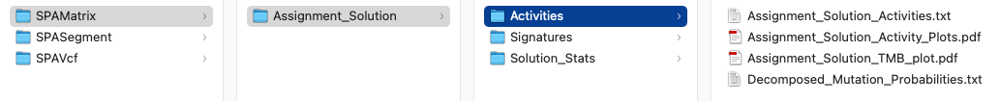
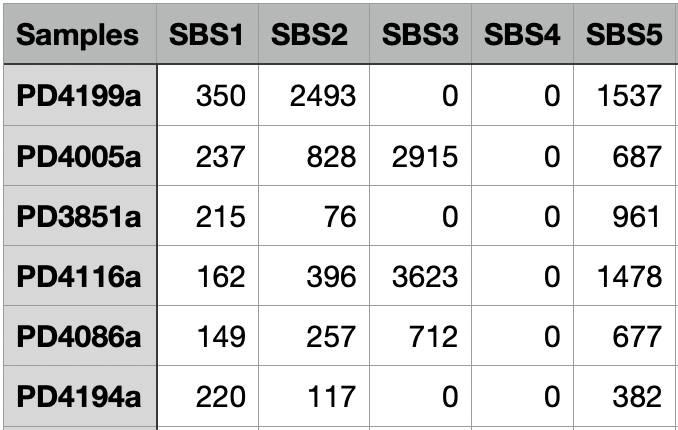
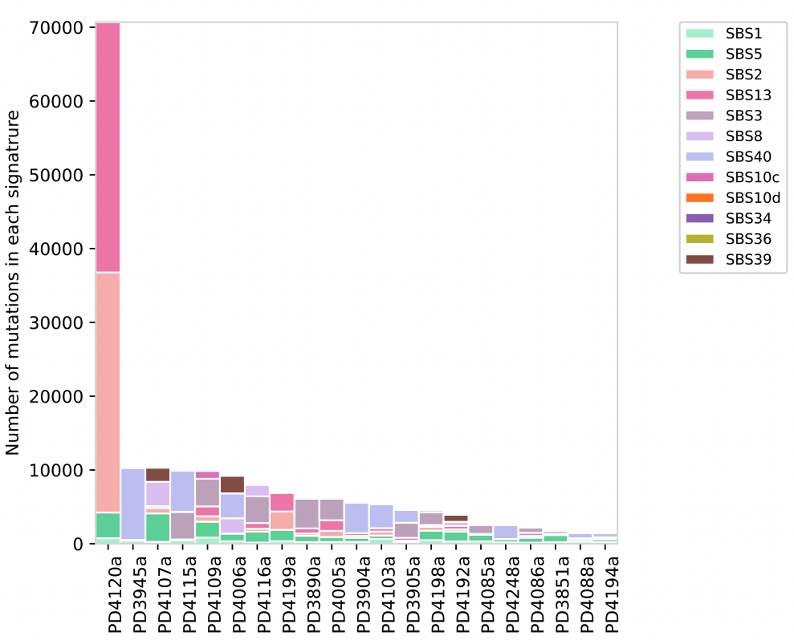
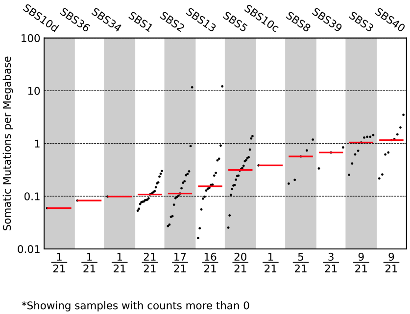
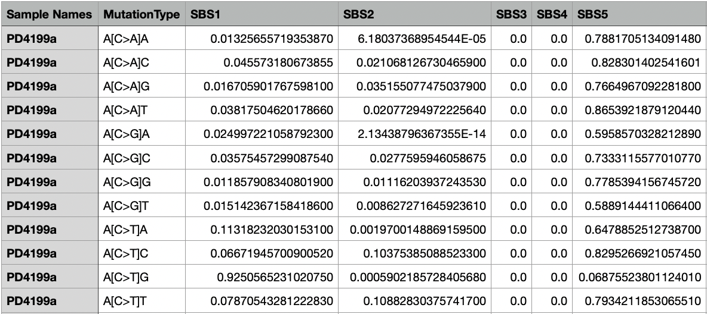
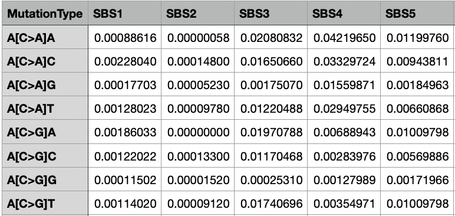
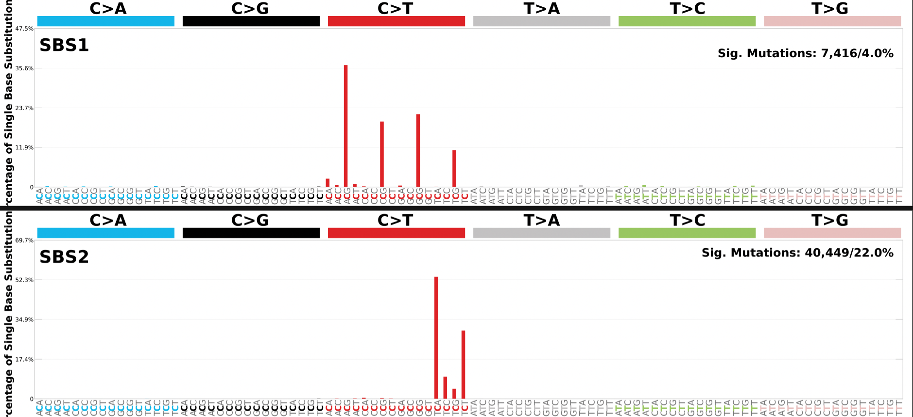
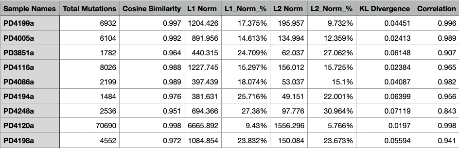
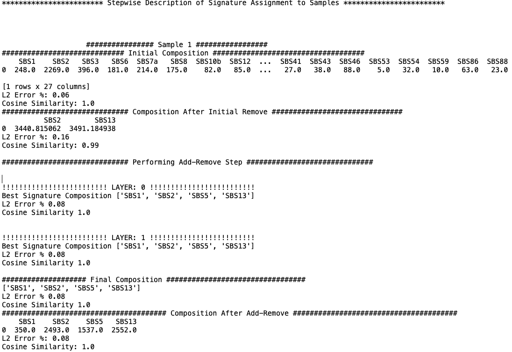

# Using SigProfilerAssignment - Output #

----------

This section describes the output files of SigProfilerAssignment. The Assignment_Solution directory contains files organized into the three subdirectories: `Activities`, `Signatures`, and `Solution_Stats`. 

----------

## Output Overview ##
In the screenshot below, there are 3 subdirectories `Activities`, `Signatures`, and `Solution_Stats`. The files examined below are from the SigProfilerAssignment results using as input a mutational matrix derived from 21 breast cancer samples from [Nik-Zainal et al. 2012 Cell][1].

The files in their respective directories are listed below:

 - Activities
    - Assignment_Solution_Activities.txt     
    - Assignment_Solution_Activity_Plots.pdf
    - Assignment_Solution_TMB_plot.pdf
    - Decomposed_Mutation_Probabilities.txt
 - Signatures
    - Assignment_Solution_Signatures.txt
    - SBS_96_plots_Assignment_Solution.pdf
 - Solution_Stats
    - Assignment_Solution_Samples_Stats.txt
    - Assignment_Solution_Signature_Assignment_log.txt

## Activities Directory ##

### Assignment_Solution_Activities.txt ###

The `Assignment_Solution_Activities.txt` file contains the activity matrix for the selected signatures. The first column lists all of the samples and the second and the following columns list the calculated activity value for the respective signatures. The number of columns is the number of signatures identified.

Below is a screenshot of the first few rows and columns of a sample file, `Assignment_Solution_Activities.txt`.

### Assignment_Solution_Activity_Plots.pdf ###
The `Assignment_Solution_Activity_Plots.pdf` plot shows the number of mutations in each signature on the y-axis and the sample name on the x-axis. The colors indicate which signature had the mutations and which signatures were found in each sample.

### Assignment_Solution_TMB_plot.pdf ###
The `Assignment_Solution_TMB_plot.pdf` file contains a tumor mutational burden plot. The y-axis is the somatic mutations per megabase and the x-axis is the number of samples plotted over the number of samples included. The column names are the mutational signatures and the plot is ordered by the median somatic mutations per megabase.

### Decomposed_Mutation_Probabilities.txt ###
The `Decomposed_Mutation_Probabilities.txt` file includes the probabilities of each mutation type (in this particular example, a total of 96 mutation types) in each sample. The first column lists all the samples, the second column lists all the mutation types, and the following columns list the calculated probability value for the respective signatures.

## Signatures Directory ##
### Assignment_Solution_Signatures.txt ###
The `Assignment_Solution_Signatures.txt` file contains the distribution of mutation types in the input mutational signatures. The first column lists all of the mutation types. There are 96 possible mutations that are considered for the SBS-96 context. The following columns are the signatures. Only the first few rows and columns are shown in the image below; however, the sum of each column is 1, and each value in a column indicates the proportion of a mutational context in the signature.

### SBS_96_plots_Assignment_Solution.pdf ###
The `SBS_96_plots_Assignment_Solution.pdf` has plots for each signature identified that depicts the proportion of the mutation types for that signature. 

In the example below the plot generated for the first two signatures (SBS1 and SBS2) identified in the input samples. The top right corner also lists the total number of mutations and the percentage of total mutations assigned to the mutational signature.

## Solutions_Stats Directory ##
### Assignment_Solution_Samples_Stats.txt ###
The `Assignment_Solution_Samples_Stats.txt` file contains the statistics for each sample including the total number of mutations, cosine similarity, L1 norm (calculated as the sum of the absolute values of the vector), L1 norm percentage, L2 norm (calculated as the square root of the sum of the squared vector values), and L2 norm percentage, along with the KL divergence.

Below is an example of a `Assignment_Solution_Samples_Stats.txt` file.

### Assignment_Solution_Signature_Assignment_log.txt ###
The `Assignment_Solution_Signature_Assignment_log.txt` file records the events that occur when known signatures are assigned to an input sample. The information includes the L2 error and cosine similarity between the reconstructed and original sample within different composition steps. 

Below is an example of the start of the log file.

  [1]: https://doi.org/10.1016/j.cell.2012.04.024
